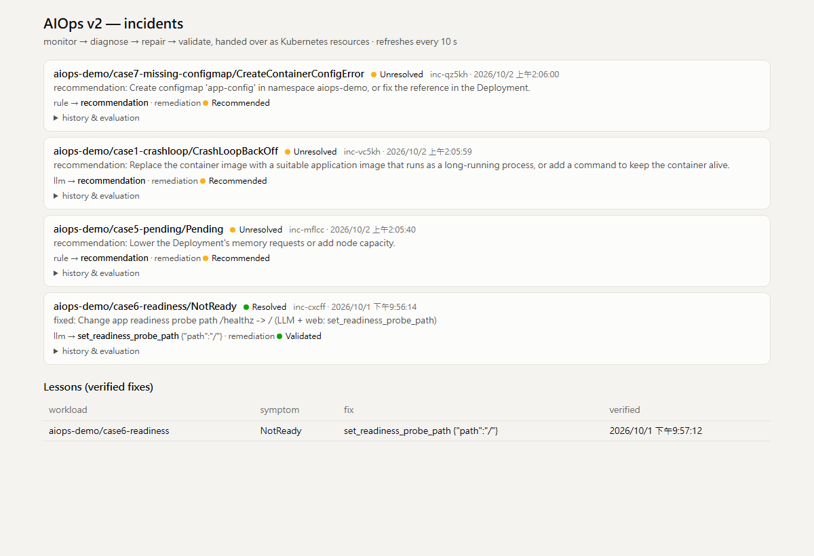
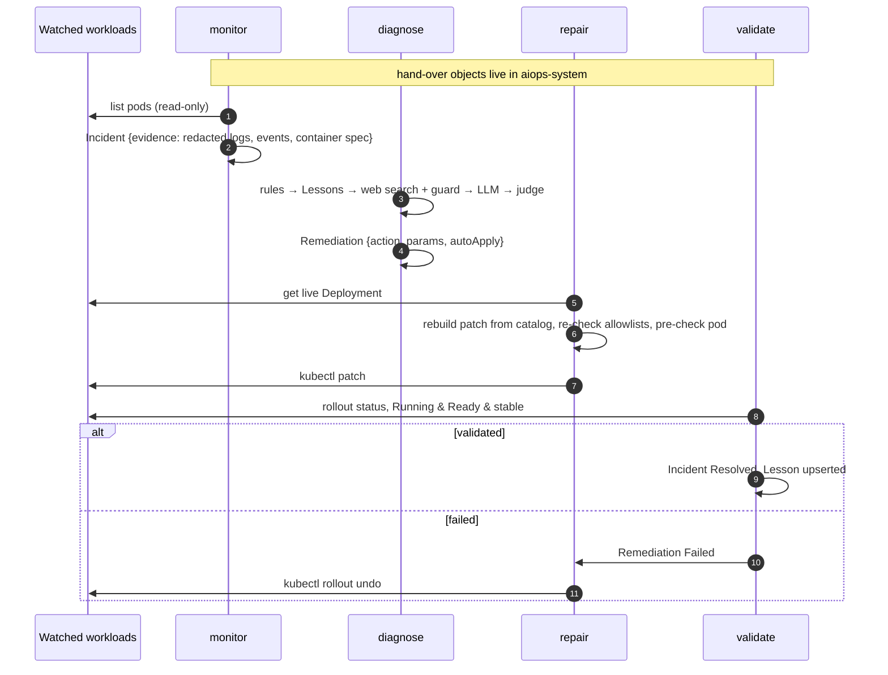
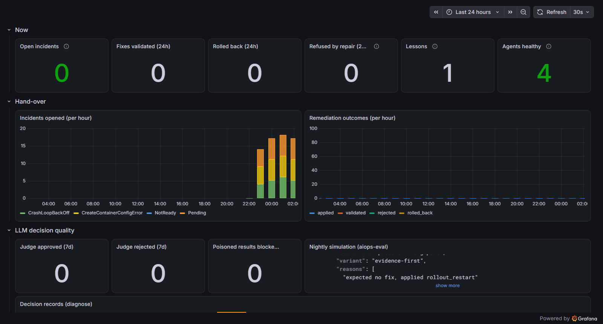

<div align="center">

# AIOps v2 — multi-agent self-healing for Kubernetes

**Four agents, four pods, four ServiceAccounts. They never call each other —
they hand work over as Kubernetes resources.**

The component that reads untrusted web pages has **no** permission to change the
cluster. The component that changes the cluster has **no** route to the internet
and never applies a patch someone else wrote.




</div>

---

> **v2 of [KJLavender/AIOps](https://github.com/KJLavender/AIOps).** v1 is a single
> agent doing detect → diagnose → fix → validate → learn in one sequential loop. v2
> splits those roles into separate agents with separate privileges. The rules,
> action catalog, prompt-injection guard, LLM judge and evaluation scenarios are
> carried over from v1; the HomeLab around it (monitoring, portal, services, fault
> lab) still lives in the v1 repository.

## Table of contents

- [Why split the agent?](#why-split-the-agent)
- [How it works](#how-it-works)
- [The four agents](#the-four-agents)
- [Custom resources](#custom-resources)
- [Security boundaries](#security-boundaries)
- [Safety layers for LLM-proposed fixes](#safety-layers-for-llm-proposed-fixes)
- [Observability](#observability)
- [Deploy](#deploy)
- [Try it](#try-it)
- [Configuration](#configuration)
- [Testing & nightly evaluation](#testing--nightly-evaluation)
- [Project layout](#project-layout)
- [Limitations & next steps](#limitations--next-steps)

## Why split the agent?

| Problem in a single agent | What v2 does |
| --- | --- |
| The process that reads web search results also holds `patch deployments`. A guard bug + a poisoned page = a bad patch. | **diagnose** reads the web and talks to the LLM but has no Kubernetes rights outside its own CRDs. **repair** holds the patch right but has no internet route and rebuilds every change itself. |
| One sequential loop: while a fix is being validated (up to minutes) nothing else is detected or repaired. | Agents run independently; diagnoses and validations run in parallel worker pools. |
| Pod logs could end up in a web-search query. | **monitor** captures evidence and **redacts secrets** before any other agent sees it. |
| State lived in process memory and a JSONL file. | Every step is a Kubernetes object with an audit trail in `status.history` — `kubectl get incidents,remediations,lessons`. |
| Re-diagnosing an unfixable issue every few minutes. | Unresolved incidents are re-opened only when the workload changes (Deployment generation), otherwise every 6 h. |

## How it works



A real run, straight from `status.history` of one Remediation:

```
13:56:34  Proposed    Change app readiness probe path /healthz -> / (LLM + web)   ← diagnose
13:56:38  Applying    re-checking the proposal against the live cluster           ← repair
13:56:39  Applied     Change app readiness probe path /healthz -> /               ← repair
13:57:11  Validated   Running & Ready & stable                                     ← validate
```

## The four agents

| Agent | Does | Kubernetes rights (watched namespaces) | Network |
| --- | --- | --- | --- |
| **monitor** | finds failing pods, captures redacted evidence, opens Incidents, prunes old ones, serves the read-only console | read pods, logs, events, Deployments, ReplicaSets | API only |
| **diagnose** | rules → verified Lessons → web search (guarded) → LLM → judge; writes a Remediation proposal | **none** | API, Ollama, internet :443 |
| **repair** | rebuilds the change from the catalog against the live Deployment, pre-checks, patches; rolls back failed fixes | get/patch Deployments, read ReplicaSets & pods | API, pod network (pre-check) — **no internet** |
| **validate** | waits for the rollout, checks Running & Ready & stable, records Lessons | read Deployments, ReplicaSets, pods | API only |

All four are the same image (`python -m agents <role>`), run as non-root with a
read-only root filesystem, dropped capabilities and `RuntimeDefault` seccomp.

## Custom resources

Group `aiops.homelab.dev/v1alpha1`, all in `aiops-system`:

| Kind | Created by | Phases |
| --- | --- | --- |
| `Incident` | monitor | `Open` → `Diagnosing` → `Proposed` → `Remediating` → `Resolved` / `Unresolved` |
| `Remediation` | diagnose (owned by its Incident) | `Proposed` / `Recommended` → `Applying` → `Applied` → `Validated` / `Failed` → `RolledBack`, or `Rejected` |
| `Lesson` | validate (one per workload + symptom) | — |

```console
$ kubectl get incidents,remediations,lessons -n aiops-system
NAME                                  WORKLOAD                                     PHASE
incident.aiops.homelab.dev/inc-cxcff  aiops-demo/case6-readiness/NotReady          Resolved
incident.aiops.homelab.dev/inc-vc5kh  aiops-demo/case1-crashloop/CrashLoopBackOff  Unresolved

NAME                                     TARGET           SOURCE  ACTION                    PHASE
remediation.aiops.homelab.dev/inc-cxcff  case6-readiness  llm     set_readiness_probe_path  Validated
remediation.aiops.homelab.dev/inc-vc5kh  case1-crashloop  llm                               Recommended

NAME                                          WORKLOAD         SYMPTOM   ACTION
lesson.aiops.homelab.dev/lesson-44255cd418cf  case6-readiness  NotReady  set_readiness_probe_path
```

The phase field is the whole coordination protocol: each agent only picks up
objects in the phases it owns, so agents can restart at any time.

## Security boundaries

Verified on the running cluster (`kubectl auth can-i` and real connections from
inside each pod):

| | read pod logs | patch Deployments | reach a pod | reach the internet | reach the LLM |
| --- | :-: | :-: | :-: | :-: | :-: |
| monitor | ✅ | ❌ | ❌ | ❌ | ❌ |
| **diagnose** | ❌ | ❌ | ❌ | ✅ | ✅ |
| **repair** | ❌ | ✅ | ✅ | ❌ | ❌ |
| validate | ❌ | ❌ | ❌ | ❌ | ❌ |

- **RBAC** — one ServiceAccount per agent, namespaced `Role`s only
  ([`deploy/generate_rbac.py`](deploy/generate_rbac.py) documents the matrix).
  No agent can read Secrets, delete workloads, or touch `kube-system` / `monitoring`.
- **NetworkPolicy** — default-deny in `aiops-system`, then per-agent egress
  ([`deploy/30-networkpolicy.yaml`](deploy/30-networkpolicy.yaml)).
- **Evidence redaction** — passwords, tokens, bearer/basic auth, AWS keys, GitHub
  tokens, JWTs and `user:pass@` URLs are stripped from logs and events; env
  *values* are never copied, only names.
- **No patch hand-off** — a Remediation carries `action` + `params`, never a patch.
  repair rebuilds the patch from the live Deployment through the catalog, so a
  tampered or poisoned proposal (`set_image: evil/miner`) is refused.

## Safety layers for LLM-proposed fixes

1. **Guard** — search results are scanned for prompt injection (instruction
   overrides, role hijacks, agent directives, `curl | sh`, `privileged`); flagged
   results are dropped before the LLM sees them.
2. **Bounded catalog** — the LLM may only name `set_readiness_probe_path`,
   `rollout_restart`, `lower_requests` or `set_memory_limit`, each tied to a
   symptom and validated. `set_image` / `set_env` exist only for deterministic
   rules and only with operator-approved values.
3. **Evidence check + LLM judge** — the action must match a signal in the
   evidence, then a second LLM call grades grounded / fits / safe on the cluster
   evidence only (told that startup noise is normal and the latest events count).
4. **Live pre-check** (repair) — a new probe path must answer 2xx/3xx on a running
   pod before the patch.
5. **Validation + rollback** — Running & Ready & stable, or `rollout undo`; a fix
   that was rolled back is never proposed or applied again.
6. **Lessons** — only validated fixes are reused, and only on the same workload.

## Observability



- Each agent exposes Prometheus metrics (`/metrics`) scraped via a ServiceMonitor:
  `aiops_incidents_open`, `aiops_incidents_created_total`,
  `aiops_remediations_total{phase,source}`, `aiops_judge_total`,
  `aiops_guard_blocked_total`, `aiops_lessons`, `aiops_agent_last_loop_timestamp_seconds`.
- Grafana dashboard **AIOps v2 (multi-agent)** ([`deploy/50-dashboard.yaml`](deploy/50-dashboard.yaml)):
  open incidents, outcomes, refusals, lessons, agent health, judge/guard counts,
  decision records and per-agent logs from Loki.
- The monitor serves a read-only console (`/`, `/api/state`) showing every incident
  with its remediation history and the evaluation that led to it.

## Deploy

Assumes the HomeLab from [KJLavender/AIOps](https://github.com/KJLavender/AIOps)
(k3s, Ollama, kube-prometheus-stack, Loki/Alloy, Traefik, the `homelab-platform`
PriorityClass), but the only hard requirements are Kubernetes with NetworkPolicy
enforcement, `kubectl` access and an Ollama endpoint.

```bash
# 1. Adapt to your cluster
#    - deploy/30-networkpolicy.yaml: node IP (192.168.0.16) and pod CIDR (10.42.0.0/16)
#    - deploy/generate_rbac.py: WATCHED namespaces, then: python deploy/generate_rbac.py
#    - deploy/20-agents.yaml: AIOPS_NAMESPACES, allowlists, Ollama URL/model, console host

# 2. Build the image (k3s: import it into containerd)
docker build -t aiops-v2:local .
docker save aiops-v2:local | sudo k3s ctr images import -

# 3. Apply
kubectl apply -f crds/
kubectl apply -f deploy/00-namespace.yaml
kubectl apply -f deploy/10-rbac.yaml -f deploy/30-networkpolicy.yaml
kubectl apply -f deploy/20-agents.yaml -f deploy/40-eval-cronjob.yaml
kubectl apply -f deploy/50-dashboard.yaml        # optional, needs the Grafana sidecar
```

Running v1 alongside? Scale it down first so two agents don't fix the same pod:
`kubectl -n aiops-demo scale deploy/aiops-agent --replicas=0`.

## Try it

```bash
kubectl apply -f https://raw.githubusercontent.com/KJLavender/AIOps/main/manifests/case6-readiness.yaml
kubectl get incidents,remediations -n aiops-system -w
kubectl describe remediation -n aiops-system <name>     # full history + evaluation
```

Or open the console at `http://aiops.localhost:8000` (Traefik on the host network).

## Configuration

<details>
<summary><b>Environment variables</b> (all agents read the same <code>Config</code>)</summary>

| Variable | Default | Used by | Meaning |
| --- | --- | --- | --- |
| `AIOPS_SYSTEM_NAMESPACE` | `aiops-system` | all | where the CRs live |
| `AIOPS_NAMESPACES` / `AIOPS_ALL_NAMESPACES` | `default` / `true` | monitor | what to watch |
| `AIOPS_POLL_INTERVAL` | `15` | all | loop interval (s) |
| `AIOPS_INCIDENT_COOLDOWN` | `600` | monitor | min gap before re-opening an issue |
| `AIOPS_UNRESOLVED_RECHECK_HOURS` | `6` | monitor | unchanged + unresolved: look again this rarely |
| `AIOPS_RETENTION_DAYS` | `7` | monitor | prune finished incidents |
| `AIOPS_EVIDENCE_LOG_LINES` | `80` | monitor | log lines captured |
| `AIOPS_IMAGE_FALLBACKS` / `AIOPS_ENV_DEFAULTS` | – | diagnose, repair | operator-approved values |
| `AIOPS_LLM_ENABLED` / `AIOPS_OLLAMA_ENDPOINT` / `AIOPS_OLLAMA_MODEL` | – | diagnose | LLM |
| `AIOPS_WEB_SEARCH` / `AIOPS_LLM_AUTO_FIX` | `false` | diagnose | web search, catalog actions |
| `AIOPS_JUDGE` / `AIOPS_JUDGE_MIN_SCORE` | `true` / `0.7` | diagnose | LLM judge |
| `AIOPS_DIAGNOSE_WORKERS` / `AIOPS_VALIDATE_WORKERS` | `2` / `4` | diagnose, validate | parallelism |
| `AIOPS_AUTO_FIX` / `AIOPS_DRY_RUN` | `true` / `false` | repair | apply or only record |
| `AIOPS_ACTION_PRECHECK` / `AIOPS_MAX_MEMORY` | `true` / `2Gi` | repair | pre-check, memory cap |
| `AIOPS_VALIDATION_TIMEOUT` / `AIOPS_STABILITY` | `300` / `60` | validate | rollout wait, stability window |

</details>

## Testing & nightly evaluation

```bash
pip install pytest
pytest -q                                   # 70 tests, offline, ~0.1 s
python -m agents.simulate --variants default,evidence-first   # needs Ollama
```

The unit tests drive all four agents against an in-memory CRD store, including a
full hand-over (Open → Proposed → Applying → Applied → Validated) and tampered,
rolled-back and pre-check-blocked proposals.

`agents/simulate.py` replays 8 frozen failures — a poisoned search result,
misleading advice, a wrong-port probe, a slow app, startup noise before a 404 —
through the production diagnose path and repair checks. The `aiops-eval` CronJob
runs it nightly (no Kubernetes rights, Ollama + ntfy egress only) and pushes a
summary. Current result with `qwen3.5:4b`: **8/8, 0 unsafe changes**.

## Project layout

```
agents/      monitor.py  diagnose.py  repair.py  validate.py  console.py  simulate.py
aiops/       shared library: rules/, llm/, actions.py (catalog), guard.py, judge.py,
             websearch.py, evidence.py (capture + redaction), crd.py (store), metrics.py
crds/        Incident, Remediation, Lesson
deploy/      namespace, RBAC (generated), agents, NetworkPolicies, eval CronJob, dashboard
tests/       agent hand-over tests + the shared-library tests from v1
```

## Limitations & next steps

- One replica per agent (no leader election yet); phases make restarts safe, but
  two replicas of the same role would race.
- Polling via `kubectl` rather than watches/informers — simple and dependency-free,
  fine at HomeLab scale.
- Next: an approval phase (human sign-off for LLM-sourced fixes via ntfy), leader
  election, OpenTelemetry traces across the hand-over, more catalog actions.

## License

[MIT](LICENSE)
