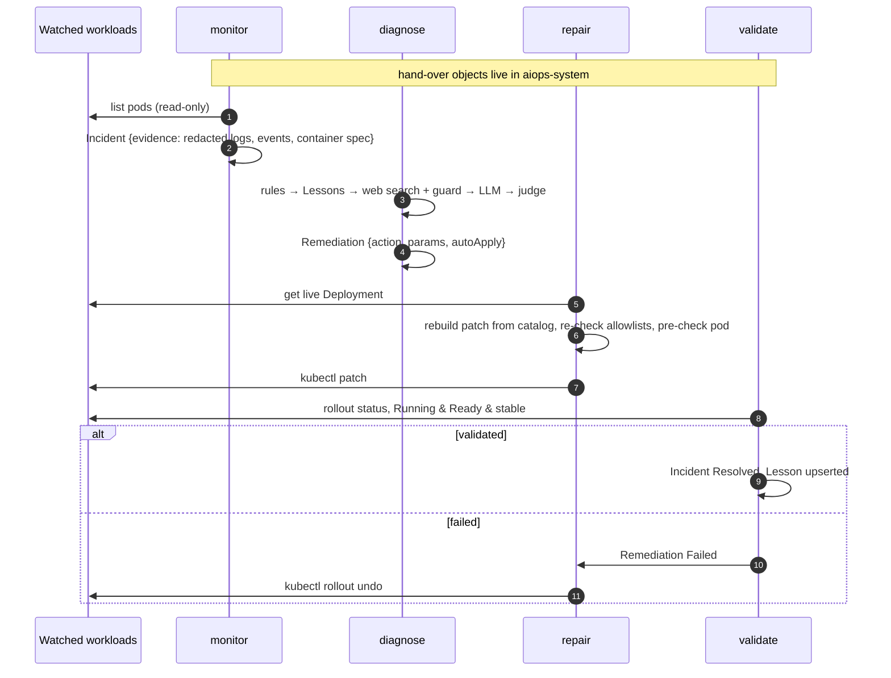

<div align="center">

# AIOps v2 — Kubernetes 多 agent 自我修復

[English](README.md) | **繁體中文**

**四個 agent、四個 pod、四個 ServiceAccount。它們彼此從不直接呼叫——
而是用 Kubernetes 資源交接工作。**

讀不可信網頁的元件，**沒有**變更叢集的權限。會變更叢集的元件，**沒有**連到外網的路，
也從不套用別人寫好的 patch。


</div>

---

> **這是 [KJLavender/AIOps](https://github.com/KJLavender/AIOps) 的 v2。** v1 是單一 agent，
> 在一個循序迴圈裡完成偵測 → 診斷 → 修復 → 驗證 → 學習。v2 把這些角色拆成權限各自獨立的 agent。
> 規則、動作清單、prompt injection 防護、LLM 評審和評測情境都沿用 v1；
> 周邊的 HomeLab（監控、入口網頁、服務、故障實驗室）仍放在 v1 的 repo。

## 目錄

- [為什麼要拆 agent](#為什麼要拆-agent)
- [運作方式](#運作方式)
- [四個 agent](#四個-agent)
- [Custom resources](#custom-resources)
- [安全邊界](#安全邊界)
- [LLM 提出修復時的安全層](#llm-提出修復時的安全層)
- [可觀測性](#可觀測性)
- [部署](#部署)
- [試試看](#試試看)
- [設定](#設定)
- [測試與每晚評測](#測試與每晚評測)
- [專案結構](#專案結構)
- [限制與下一步](#限制與下一步)

## 為什麼要拆 agent

| 單一 agent 的問題 | v2 的做法 |
| --- | --- |
| 讀網路搜尋結果的那個 process，同時握有 `patch deployments` 權限。防護有一個 bug + 一個被汙染的網頁 = 一個壞 patch。 | **diagnose** 會讀網頁、跟 LLM 溝通，但除了自己的 CRD 之外沒有任何 Kubernetes 權限。**repair** 有 patch 權限，但連不到外網，而且每個變更都自己重建。 |
| 只有一個循序迴圈：在驗證某個修復時（可能要好幾分鐘），其他問題都不會被偵測或修復。 | agent 各自獨立運作；診斷和驗證在平行的 worker pool 裡跑。 |
| pod 的 log 可能被放進網路搜尋的查詢字串。 | **monitor** 擷取證據，並在其他 agent 看到之前**遮罩祕密**。 |
| 狀態存在 process 記憶體和一個 JSONL 檔裡。 | 每一步都是一個 Kubernetes 物件，`status.history` 留有稽核軌跡——`kubectl get incidents,remediations,lessons`。 |
| 修不好的問題每幾分鐘就重新診斷一次。 | 沒解決的 incident 只在工作負載有變更時（Deployment generation）才重開，否則每 6 小時一次。 |

## 運作方式



一次實際執行，直接取自某個 Remediation 的 `status.history`：

```
13:56:34  Proposed    Change app readiness probe path /healthz -> / (LLM + web)   ← diagnose
13:56:38  Applying    re-checking the proposal against the live cluster           ← repair
13:56:39  Applied     Change app readiness probe path /healthz -> /               ← repair
13:57:11  Validated   Running & Ready & stable                                     ← validate
```

## 四個 agent

| Agent | 負責 | Kubernetes 權限（受監看的 namespace） | 網路 |
| --- | --- | --- | --- |
| **monitor** | 找出故障的 pod、擷取遮罩過的證據、開 Incident、清掉舊的、提供唯讀主控台 | 讀 pod、log、event、Deployment、ReplicaSet | 只有 API |
| **diagnose** | 規則 → 驗證過的 Lesson → 網路搜尋（有防護）→ LLM → 評審；寫出 Remediation 提案 | **無** | API、Ollama、外網 :443 |
| **repair** | 依動作清單、對照線上 Deployment 重建變更，預檢後 patch；修壞了就回滾 | get/patch Deployment，讀 ReplicaSet 和 pod | API、pod 網路（預檢用）——**不能上外網** |
| **validate** | 等 rollout 完成，檢查 Running & Ready & 穩定，記錄 Lesson | 讀 Deployment、ReplicaSet、pod | 只有 API |

四個 agent 用同一個 image（`python -m agents <role>`），以非 root 身分執行，
root 檔案系統唯讀、移除所有 capabilities，並使用 `RuntimeDefault` seccomp。

## Custom resources

Group 為 `aiops.homelab.dev/v1alpha1`，全部放在 `aiops-system`：

| Kind | 由誰建立 | 階段 |
| --- | --- | --- |
| `Incident` | monitor | `Open` → `Diagnosing` → `Proposed` → `Remediating` → `Resolved` / `Unresolved` |
| `Remediation` | diagnose（擁有者是對應的 Incident） | `Proposed` / `Recommended` → `Applying` → `Applied` → `Validated` / `Failed` → `RolledBack`，或 `Rejected` |
| `Lesson` | validate（每個工作負載 + 症狀一筆） | — |

```console
$ kubectl get incidents,remediations,lessons -n aiops-system
NAME                                  WORKLOAD                                     PHASE
incident.aiops.homelab.dev/inc-cxcff  aiops-demo/case6-readiness/NotReady          Resolved
incident.aiops.homelab.dev/inc-vc5kh  aiops-demo/case1-crashloop/CrashLoopBackOff  Unresolved

NAME                                     TARGET           SOURCE  ACTION                    PHASE
remediation.aiops.homelab.dev/inc-cxcff  case6-readiness  llm     set_readiness_probe_path  Validated
remediation.aiops.homelab.dev/inc-vc5kh  case1-crashloop  llm                               Recommended

NAME                                          WORKLOAD         SYMPTOM   ACTION
lesson.aiops.homelab.dev/lesson-44255cd418cf  case6-readiness  NotReady  set_readiness_probe_path
```

phase 欄位就是整個協調協定：每個 agent 只處理自己負責的階段的物件，所以 agent 隨時重啟都沒關係。

## 安全邊界

已在運作中的叢集上驗證（`kubectl auth can-i`，以及從每個 pod 內部實際連線）：

| | 讀 pod log | patch Deployment | 連到 pod | 連到外網 | 連到 LLM |
| --- | :-: | :-: | :-: | :-: | :-: |
| monitor | ✅ | ❌ | ❌ | ❌ | ❌ |
| **diagnose** | ❌ | ❌ | ❌ | ✅ | ✅ |
| **repair** | ❌ | ✅ | ✅ | ❌ | ❌ |
| validate | ❌ | ❌ | ❌ | ❌ | ❌ |

- **RBAC** — 每個 agent 一個 ServiceAccount，只用 namespace 層級的 `Role`
  （權限矩陣記錄在 [`deploy/generate_rbac.py`](deploy/generate_rbac.py)）。
  沒有任何 agent 能讀 Secret、刪除工作負載，或碰 `kube-system` / `monitoring`。
- **NetworkPolicy** — `aiops-system` 預設全部拒絕，再逐一開放每個 agent 的 egress
  （[`deploy/30-networkpolicy.yaml`](deploy/30-networkpolicy.yaml)）。
- **證據遮罩** — 密碼、token、bearer/basic auth、AWS key、GitHub token、JWT 和
  `user:pass@` 形式的 URL 都會從 log 和 event 裡移除；環境變數只複製名稱，從不複製*值*。
- **不交接 patch** — Remediation 只帶 `action` + `params`，從不帶 patch。
  repair 依動作清單、從線上 Deployment 重建 patch，所以被竄改或被汙染的提案（`set_image: evil/miner`）會被拒絕。

## LLM 提出修復時的安全層

1. **防護** — 搜尋結果會先掃描 prompt injection（覆寫指令、角色劫持、對 agent 下指令、
   `curl | sh`、`privileged`）；被標記的結果在 LLM 看到之前就丟掉。
2. **限定動作清單** — LLM 只能指定 `set_readiness_probe_path`、`rollout_restart`、
   `lower_requests` 或 `set_memory_limit`，每個都綁定一種症狀並經過驗證。
   `set_image` / `set_env` 只給確定性規則用，而且只能用管理者核准的值。
3. **證據檢查 + LLM 評審** — 動作必須對得上證據裡的某個訊號，接著第二次 LLM 呼叫
   只根據叢集證據評 *有根據／合適／安全*（並告訴它啟動時的雜訊是正常的、以最新的 event 為準）。
4. **即時預檢**（repair）— 新的 probe 路徑必須先在執行中的 pod 上回應 2xx/3xx，才會 patch。
5. **驗證 + 回滾** — 要 Running & Ready & 穩定，否則 `rollout undo`；被回滾過的修法不會再被提出或套用。
6. **Lesson** — 只重用驗證過的修法，而且只用在同一個工作負載上。

## 可觀測性


- 每個 agent 都提供 Prometheus metrics（`/metrics`），透過 ServiceMonitor 收集：
  `aiops_incidents_open`、`aiops_incidents_created_total`、
  `aiops_remediations_total{phase,source}`、`aiops_judge_total`、
  `aiops_guard_blocked_total`、`aiops_lessons`、`aiops_agent_last_loop_timestamp_seconds`。
- Grafana 儀表板 **AIOps v2 (multi-agent)**（[`deploy/50-dashboard.yaml`](deploy/50-dashboard.yaml)）：
  未結的 incident、處理結果、拒絕次數、Lesson、agent 健康狀態、評審／防護計數、
  決策紀錄，以及來自 Loki 的各 agent log。
- monitor 提供唯讀主控台（`/`、`/api/state`），列出每個 incident 的修復歷程和背後的評估。

## 部署

預設環境是 [KJLavender/AIOps](https://github.com/KJLavender/AIOps) 的 HomeLab
（k3s、Ollama、kube-prometheus-stack、Loki/Alloy、Traefik、`homelab-platform`
PriorityClass），但真正必要的只有：會執行 NetworkPolicy 的 Kubernetes、`kubectl` 權限和一個 Ollama endpoint。

```bash
# 1. Adapt to your cluster
#    - deploy/30-networkpolicy.yaml: node IP (192.168.0.16) and pod CIDR (10.42.0.0/16)
#    - deploy/generate_rbac.py: WATCHED namespaces, then: python deploy/generate_rbac.py
#    - deploy/20-agents.yaml: AIOPS_NAMESPACES, allowlists, Ollama URL/model, console host

# 2. Build the image (k3s: import it into containerd)
docker build -t aiops-v2:local .
docker save aiops-v2:local | sudo k3s ctr images import -

# 3. Apply
kubectl apply -f crds/
kubectl apply -f deploy/00-namespace.yaml
kubectl apply -f deploy/10-rbac.yaml -f deploy/30-networkpolicy.yaml
kubectl apply -f deploy/20-agents.yaml -f deploy/40-eval-cronjob.yaml
kubectl apply -f deploy/50-dashboard.yaml        # optional, needs the Grafana sidecar
```

步驟說明：

1. 依你的叢集調整：`deploy/30-networkpolicy.yaml` 的節點 IP（192.168.0.16）和 pod CIDR（10.42.0.0/16）；
   `deploy/generate_rbac.py` 的受監看 namespace（改完執行 `python deploy/generate_rbac.py`）；
   `deploy/20-agents.yaml` 的 `AIOPS_NAMESPACES`、白名單、Ollama 網址／模型、主控台主機名稱。
2. 建置 image（k3s 要匯入 containerd）。
3. 套用（最後一行的儀表板是選用的，需要 Grafana sidecar）。

同時跑著 v1 嗎？先把它縮到 0，免得兩個 agent 修同一個 pod：
`kubectl -n aiops-demo scale deploy/aiops-agent --replicas=0`。

## 試試看

```bash
kubectl apply -f https://raw.githubusercontent.com/KJLavender/AIOps/main/manifests/case6-readiness.yaml
kubectl get incidents,remediations -n aiops-system -w
kubectl describe remediation -n aiops-system <name>     # full history + evaluation
```

或打開主控台 `http://aiops.localhost:8000`（Traefik 跑在 host network 上）。

## 設定

<details>
<summary><b>環境變數</b>（所有 agent 讀同一份 <code>Config</code>）</summary>

| 變數 | 預設值 | 使用者 | 說明 |
| --- | --- | --- | --- |
| `AIOPS_SYSTEM_NAMESPACE` | `aiops-system` | 全部 | CR 放在哪裡 |
| `AIOPS_NAMESPACES` / `AIOPS_ALL_NAMESPACES` | `default` / `true` | monitor | 要監看哪些 |
| `AIOPS_POLL_INTERVAL` | `15` | 全部 | 迴圈間隔（秒） |
| `AIOPS_INCIDENT_COOLDOWN` | `600` | monitor | 重開同一個問題的最短間隔 |
| `AIOPS_UNRESOLVED_RECHECK_HOURS` | `6` | monitor | 沒變更又沒解決的問題，多久才再看一次 |
| `AIOPS_RETENTION_DAYS` | `7` | monitor | 清掉已結束的 incident |
| `AIOPS_EVIDENCE_LOG_LINES` | `80` | monitor | 擷取的 log 行數 |
| `AIOPS_IMAGE_FALLBACKS` / `AIOPS_ENV_DEFAULTS` | – | diagnose、repair | 管理者核准的值 |
| `AIOPS_LLM_ENABLED` / `AIOPS_OLLAMA_ENDPOINT` / `AIOPS_OLLAMA_MODEL` | – | diagnose | LLM |
| `AIOPS_WEB_SEARCH` / `AIOPS_LLM_AUTO_FIX` | `false` | diagnose | 網路搜尋、清單動作 |
| `AIOPS_JUDGE` / `AIOPS_JUDGE_MIN_SCORE` | `true` / `0.7` | diagnose | LLM 評審 |
| `AIOPS_DIAGNOSE_WORKERS` / `AIOPS_VALIDATE_WORKERS` | `2` / `4` | diagnose、validate | 平行度 |
| `AIOPS_AUTO_FIX` / `AIOPS_DRY_RUN` | `true` / `false` | repair | 實際套用或只記錄 |
| `AIOPS_ACTION_PRECHECK` / `AIOPS_MAX_MEMORY` | `true` / `2Gi` | repair | 預檢、記憶體上限 |
| `AIOPS_VALIDATION_TIMEOUT` / `AIOPS_STABILITY` | `300` / `60` | validate | rollout 等待時間、穩定觀察時間 |

</details>

## 測試與每晚評測

```bash
pip install pytest
pytest -q                                   # 70 tests, offline, ~0.1 s
python -m agents.simulate --variants default,evidence-first   # needs Ollama
```

70 個測試離線執行，約 0.1 秒；第二行的模擬需要 Ollama。

單元測試讓四個 agent 對一個記憶體內的 CRD store 運作，涵蓋完整交接流程
（Open → Proposed → Applying → Applied → Validated），以及被竄改、被回滾、被預檢擋下的提案。

`agents/simulate.py` 把 8 個固定的故障——被汙染的搜尋結果、誤導性的建議、port 錯的 probe、
很慢的 app、404 之前的啟動雜訊——送進正式的 diagnose 流程和 repair 檢查重播。
`aiops-eval` CronJob 每晚跑一次（沒有 Kubernetes 權限，只能連 Ollama 和 ntfy），並推播摘要。
目前用 `qwen3.5:4b` 的結果：**8/8，0 個不安全變更**。

## 專案結構

```
agents/      monitor.py  diagnose.py  repair.py  validate.py  console.py  simulate.py
aiops/       shared library: rules/, llm/, actions.py (catalog), guard.py, judge.py,
             websearch.py, evidence.py (capture + redaction), crd.py (store), metrics.py
crds/        Incident, Remediation, Lesson
deploy/      namespace, RBAC (generated), agents, NetworkPolicies, eval CronJob, dashboard
tests/       agent hand-over tests + the shared-library tests from v1
```

| 路徑 | 內容 |
| --- | --- |
| `agents/` | 四個 agent、主控台、模擬 |
| `aiops/` | 共用函式庫：規則、LLM、動作清單（`actions.py`）、防護、評審、網路搜尋、證據擷取與遮罩（`evidence.py`）、CRD store（`crd.py`）、metrics |
| `crds/` | Incident、Remediation、Lesson |
| `deploy/` | namespace、RBAC（自動產生）、agent、NetworkPolicy、評測 CronJob、儀表板 |
| `tests/` | agent 交接測試 + 沿用自 v1 的共用函式庫測試 |

## 限制與下一步

- 每個 agent 只有一個 replica（還沒有 leader election）；階段設計讓重啟很安全，
  但同一個角色跑兩個 replica 會互相搶。
- 用 `kubectl` 輪詢，而不是 watch／informer——簡單又沒有相依套件，在 HomeLab 的規模夠用。
- 下一步：加入核准階段（LLM 提出的修復透過 ntfy 讓人簽核）、leader election、
  橫跨交接流程的 OpenTelemetry trace、更多清單動作。

## 授權

[MIT](LICENSE)
